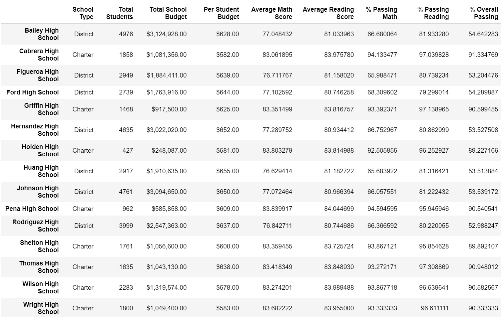
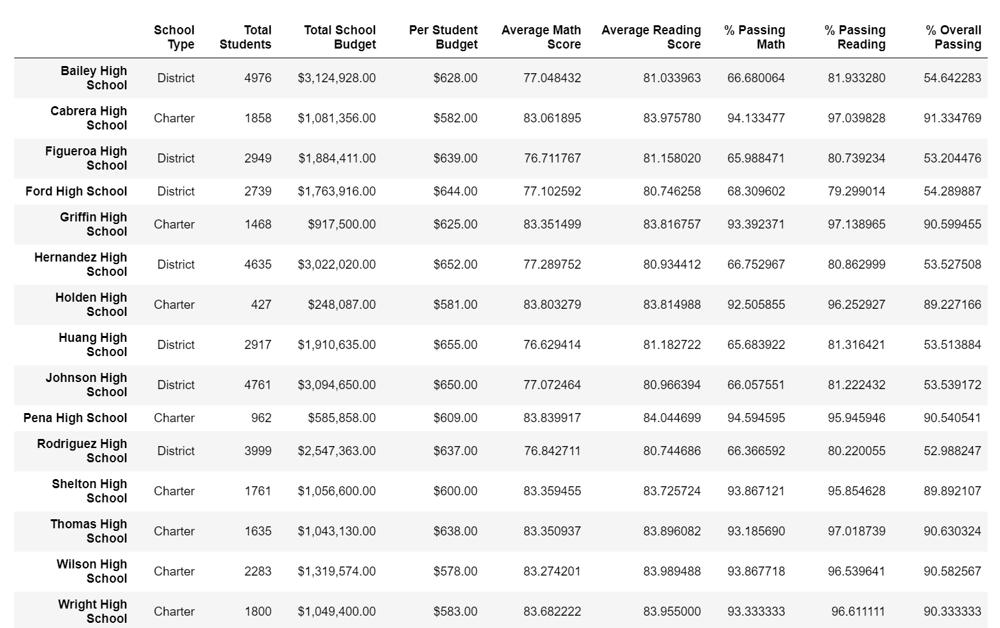

# School_District_Analysis

## Task - Aggregate the data and showcase the trends in school performance through high level snapshot of the school district's key metrics.
- Over view of metrics for each school
- Identify top and bottom five schools based on overall passing rates
- Average math and reading scores in each grade level at each school
- School performance based on budget per student
- School performance based on school size
- School performance based the school type (Charter, District)

## Task for Challenge
- Academic dishonesty was reported for Thomas High School(THS) ninth graders specifically, reading and math grades.
- We will remove the ninth grade reading and math scores and refactor the data to uphold the state-testing standards.

## Results
- There were 461 freshman from THS (Out [10]) {not a required calc}.  There were 39170 students in the district with 100% completion of exams, making up a group .01% of the overall students tested.
- There were 11408 freshman in the district overall increasing the impact of the THS sample removed to .04%.
- Overall average scores were barely affected (See below Old/New Summary below).
- Individual School Results were changed dramaticly by removing THS 9th grade boosting their averages, disproportionately propelling them into the top five schools.

## Scores Compared

### Old Overall Scores Overall Summary

### New Overall Scores Overall Summary

### Old Summary by School

### New Summary by School

### Top Five Change
- Old Top Five

- New Top Five

