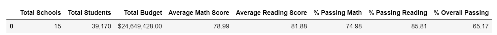
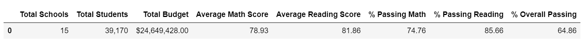
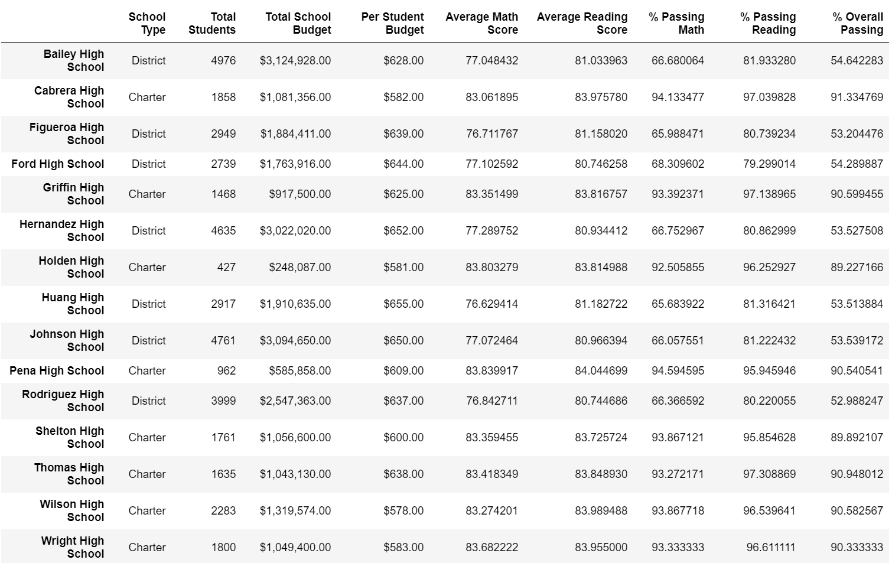
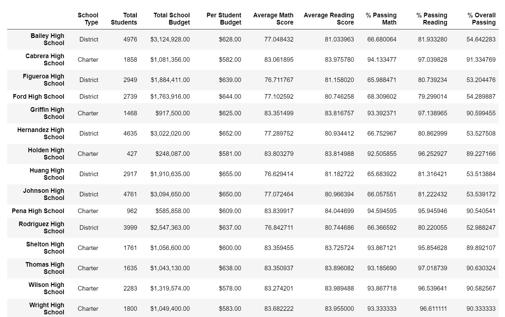
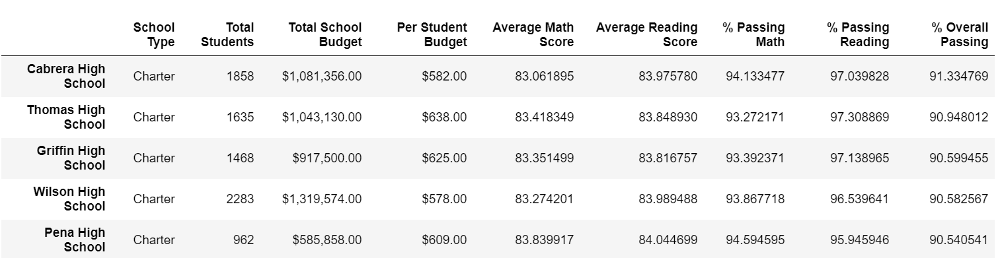

# School_District_Analysis

## Task - Aggregate the data and showcase the trends in school performance through high level snapshot of the school district's key metrics.
- Over view of metrics for each school
- Identify top five schools based on overall passing rates
- Identify bottom five schools based on overall passing rates
- Average math and reading scores in each grade level at each school
- School performance based on budget per student
- School performance based on school size
- School performance based the school type (Charter, District)

## Task for Challenge
- Academic dishonesty was reported for Thomas High School(THS) ninth graders specifically, reading and math grades.
- We will remove the ninth grade reading and math scores and refactor the data to uphold the state-testing standards.

## Results
- There were 461 freshman from THS (Out [10]) {not a required calc}.  There were 39170 students in the district with 100% completion of exams, making up a group .01% of the overall students tested.
- There were 11408 freshman in the district overall increasing the impact of the THS sample removed to .04%.
- Overall average scores were barely affected (See below Old/New Summary below).
- There was very little change to the overall passing avg of THS when the 9th grade was removed (less than a point).

## Scores Compared

### Old Scores Overall Summary

### New Scores Overall Summary

### Old Summary by School

### New Summary by School

### Top Five Change
- Old Top Five

- New Top Five

- The above graphics illustrate the change to the top five before and after removing the THS 9th grade from overall scores.
- Very little change is detected and the top five were not affected.

## Comments / Trends

Below are topics that would warrant further discussion by the school district administration and may warrant further investigation.

- It was interesting to evaluate the math and reading scores accross grades through individual schools.  Those grades did not change much from 9th to 12th grade.  To me, this would indicate systemic growth issues.  One would hope the grades would improve with continued education.

- Charter schools seem to out perform district schools with smaller class sizes, yet spending per student seems to be in the same range.

- Larger district schools typically spend more per student yet have typically lower test scores.

- District wide, reading scores trend higher than math scores.  Evaluating the math program may be in order.

### District Math Scores

### District Readign Scores

